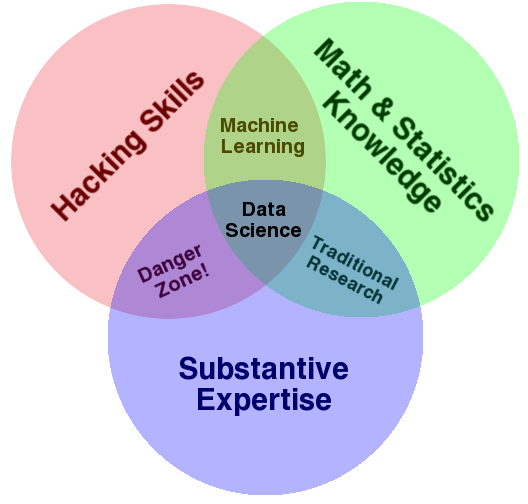

## Data is the new (s)oil

> "Half the money I spend on advertising is wasted; the trouble is I don’t know which half." —John Wanamaker 

Making data-driven decisions in business is not a new idea. For more than a century, companies have employed statistical techniques to control processes and quality in many industries, from manufacturing to agriculture. But what *is* new is the unprecedented scope of the data that can now be gathered.  

Take, for example, the above quote by nineteenth-century retailer John Wanamaker. Decades ago, measuring the effectiveness of advertising was extremely difficult, and businesses had a limited number of data-collecting strategies. And the strategies they could use—such as polling a handful of customers or tracking the conversion of a coupon in the mail—were imprecise. 

Now, retailers can get a click-by-click history of how users shop. They can directly target certain segments of customers on social media. They can even place sensors inside the store to trace traffic volumes and patterns. This *digitization* of retail has led to a deluge of data, and the breadth and depth of this data are extraordinary. Modern businesses now have accurate information on the effectiveness of all their actions, from what they sell to how and where they advertise.

Data is now what powers most commercial interactions, especially online. From the shows Netflix suggests to viewers, to the posts and advertisements people see on Facebook, to the fare a rider pays their Uber driver, companies of all kinds are leveraging their data to deliver on business objectives. 

Data has become so elemental to modern business that in 2006—two years before the term "data scientist" was even coined—British mathematician Clive Humby likened data to oil:

> "Data is the new oil. It’s valuable, but if unrefined it cannot really be used. It has to be changed into gas, plastic, chemicals, etc., to create a valuable entity that drives profitable activity; so must data be broken down, analyzed for it to have value."

Humby’s statement gets to the heart of the data science workflow. Because "unrefined data" isn't very useful, it's a data scientist's job to "refine" that data. This work can be messy, unglamorous, and time-consuming. But it's an absolutely indispensable part of contemporary business practices. Without it, companies would have no valuable insights to inform their decisions.

A popular alternative to Humby's analogy comes from British designer David McCandless, who suggests that data is not the new *oil*, but the new *soil*:

> "Data is a fertile, creative medium … which we can irrigate with networks and connectivity. Data is the new soil."

For McCandless, data is a necessary ingredient for successful business outcomes. It can, and must, be renewed and repurposed to remain a viable, productive part of company decision-making. McCandless points out that much of the data collected is customer-generated, and that helping those customers—not the data "pipeline" itself—is what makes a business successful. 

Both analogies acknowledge that data is essential, helping drive and determine business value across companies, industries, and even the economy at large. And both recognize the time and effort it takes to make data actually mean something. In fact, it often takes a team of experts specializing in different kinds of data science to do this work. Let's take a look at some common specialized roles in data science.  

## A data scientist by any other name

Most types of data science fall into one of the three disciplines of the data science Venn diagram: 

Some data scientists specialize in hacking. Others focus on math and statistics, and still others work as subject matter experts. What distinguishes someone as a data scientist is that they are still exceptionally proficient in the other disciplines. Engineer Josh Willis captured this quality by defining a data scientist as a "person who is better at statistics than any software engineer and better at software engineering than any statistician." 

Not surprisingly, data scientists are often called data scientists. But they can have other job titles, too, which you'll explore below.

### Data engineer, data architect, or machine learning engineer 
These data scientists are not just hackers, but full-fledged software engineers who can handle large amounts of data at scale. They're often experts in data science packages from R and Python. But typically, they also know how to use tools like Java for development, Hadoop for massive-scale data processing, and ETL technologies for data storage and warehousing.

These roles focus on making data work in production. This work includes troubleshooting models that have gone stale, maintaining software logs, and even looking out for security threats. 

### Statistician, mathematician, or operations researcher
Although these roles still exist in many organizations, they could be considered the closest thing to "data scientists" before data scientists really existed. Experts in these positions must perform rigorous quantitative analysis in a business context. Proprietary languages such as SAS, SPSS, and MATLAB are more common in these roles and departments. 

Titles like mathematician and operations researcher are especially common in resource-intensive industries, like transportation and manufacturing. These roles are primarily rooted in the mathematical and statistical foundations of data analysis. But professionals in these positions might not be as involved with the *productionization* of machine learning models. 

### Data analyst or business intelligence analyst
Although individuals in these roles are trained in the foundations of data science, individuals in these roles are likely to serve as the vital "go-betweens"—the expert liaisons that communicate with both the data science team and nontechnical audiences and executives. Professionals in these roles are comfortable retrieving data from databases and data warehouses to conduct small-scale analysis in tools like Excel, Tableau, and Python. 

Long-term data projects for data analysts might involve maintaining a dashboard and communicating with executives on key performance indicator (KPI) results and strategies. Data analysts may even be versed in user experience (UX) and design methodologies, and they may have experience working with HTML and JavaScript. 

## Where do all the data scientists go? 

There is no central organizing committee or licensing board of data scientists, so there’s no official voice of the data science labor market. In fact, "data scientist" is not even listed in the US Department of Labor’s [Occupational Outlook Handbook](https://www.bls.gov/ooh/home.htm) because it’s such a new, and ever-evolving, profession. What the Department of Labor *can* tell us, though, is that the employment of computer and information technology occupations is projected to [grow 13%](https://www.bls.gov/ooh/computer-and-information-technology/home.htm) from now through 2026. This is a faster growth rate than that of any other profession. So, where do all the data scientists go? Simply put, they go *everywhere*, from the public sector to nonprofits to the private sector. 

### Public sector

Many governments are undertaking [open data initiatives](https://www.state.gov/open-government-initiative/), which hire data scientists to collect, analyze, and report on data. In the United States, this work is spearheaded at [Data.gov](https://www.data.gov), which is also an excellent source of datasets. DJ Patil—whose name may sound familiar, as he helped coin the term "data scientist"—is also known for being the first [chief data scientist](https://www.wired.com/2015/02/white-house-names-dj-patil-first-us-chief-data-scientist/) of the United States. Patil's appointment symbolized the integration of data science into the public sector. 

### Nonprofits

There is a growing movement to make nonprofit organizations more data-driven and digitally literate. Although many nonprofits lack the resources to take on large-scale data projects, these organizations have strong community ties, access to robust data, and important, value-driven missions. Some organizations, like [DataKind](https://www.datakind.org/about), have become "nonprofits for nonprofits" by helping other mission-driven institutions grow their data science capacities. The Data Science for Social Good Initiative even has a paid [fellowship program](http://www.dssgfellowship.org/) to train data scientists to work with nonprofits. 

### Private sector

Data scientists work in all industries of the private sector, from retail to education to agriculture. However, they are most likely to work in knowledge-intensive industries like healthcare, finance, technology, and energy.  

#### Tech
The UK network [Tech Nation](https://technation.io/news/tech-company-definition/) defines a *tech company* as a "business that provides a digital technical service/product/platform/hardware, or heavily relies on it, as its primary revenue source." For example, Uber offers transportation services, much like a taxi company. But the key differentiator is Uber's technical platform. Lyft, Airbnb, and many other companies operate the same way, using a technical platform to provide even a simple, but in-demand, service. 

By their nature, tech companies are highly digital organizations, and this generates a lot of data. This is where the data scientist comes in. Data scientists at tech companies use data to learn about customers, meet business objectives, and validate companies' offerings. 

#### Finance
Data science [has revolutionized](https://www.investopedia.com/articles/active-trading/040915/how-big-data-has-changed-finance.asp) the finance industry, and data scientists play a valuable role in decision-making around trading and investments. Data scientists in finance also work in more internal-facing roles at banks, monitoring accounts for fraud or risk of default. They may also analyze social media activity and customer reviews to uncover insights about customer experience. And of course, there are the *quants*, or quantitative analysts, who perform rigorous analyses of financial markets and securities.

#### Health care
Data science is used in every area of health care, from forecasting emergency room visits to detecting anomalies in insurance claims. Data science has also directly affected patient care: multiple reports state that algorithms have [made better diagnoses](https://www.med.stanford.edu/news/all-news/2017/11/algorithm-can-diagnose-pneumonia-better-than-radiologists.html) than doctors. Hospitals may hire data scientists in a variety of capacities as they work to integrate highly predictive data science models with human medical expertise. 

#### Energy
Sensors and the [Internet of Things](https://www.merriam-webster.com/dictionary/Internet%20of%20Things) have provided the energy sector with massive amounts of data. Armed with that data, data scientists in this industry often work on forecasting consumption, identifying locations of potential energy sources, and preventing outages.   

#### Startups
Startups exist in all of the above industries, but they often come from tech. Working as a data scientist at a startup comes with unique challenges and rewards. While large companies likely have large data science teams with an established data infrastructure, startups are often "scrappier" when it comes to data science resources. In a startup context, the distinction between data science and data infrastructure is often blurred. You might move from being a "hacker" to being an "amateur developer" in this data science environment. 

A data scientist's ultimate objective at a startup is to validate who the customer is and what they value. The quicker a startup can learn and iterate on this value proposition, the higher the likelihood of success. Startups are working under the gun, facing short timelines and high pressure to deliver value. On top of that, data can be hard to come by at a small company, which requires further innovation on the part of the data scientist. For those reasons, data science work at a startup can be exciting and rewarding, but it can also be extremely challenging.

## The many hats of a data scientist

The specific duties of a data scientist vary across companies and industries. But on a fundamental level, data scientists work at the intersection of research, development, and storytelling. They're also privy to highly sensitive information, which means managing security and ethical considerations is another important element of the data scientist's job. 

### As a practitioner

As subject matter experts, data scientists work across a business to identify its pain points and opportunities for improvement. But some practitioners may also look at the data outside of the business context to glean more information. This work could involve staying abreast of industry news, building relationships with professionals outside of data science, and learning about the business processes that actually generate the data that they analyze. 

In entrepreneur Steve Blank’s famous words, this role of the job encourages data scientists to "[get out of the building](https://steveblank.com/2010/03/11/teaching-entrepreneurship-–-by-getting-out-of-the-building/)" and become more than just technicians. They should be business practitioners who "live and breathe" their industry and understand how to build data science projects on top of this core knowledge. 

Additionally, data scientists often play the role of internal consultant or program evaluator for business projects. By honing their skills in project and client management, data scientists can better manage competing demands on their time and prevent never-ending projects.

### As a researcher

These duties fall largely in line with what is known as the *data science workflow*. With business objectives and standards in mind, the data scientist conducts rigorous quantitative analysis using a variety of data sources. When most people—including data scientists themselves—think about what data scientists actually do, this is likely what they picture. 

### As a storyteller

With a productive and successful data science model in the works, the data scientist acts as a storyteller and presenter across their organization. They use their research to craft narratives, design compelling presentations, and deliver relevant information to a variety of expert and nonexpert audiences. 

Data scientists may need to share insights with executives and the C-suite, who are likely more interested in concrete, quantifiable objectives than in the technical details of how those objectives were achieved. Technical audiences, on the other hand, may crave this information. Data scientists may find that sharing these more granular details with other experts and their fellow data scientists may be beneficial, as data scientists often critique and learn from each other’s work. Finally, some organizations may involve data scientists in public-facing communications as well. After all, the data scientist has garnered a legendary public status, bolstered by headlines like "[the sexiest job of the 21st century](https://hbr.org/2012/10/data-scientist-the-sexiest-job-of-the-21st-century)."

### As a guardian of ethical standards

Since its emergence, the data science community has not established many central organizing principles. This has its benefits, including mass democratization: people of all backgrounds can get involved in data science. However, it has also resulted in the absence of some ethical self-policing, which exist in traditional professions like medicine and law. As the data science profession matures and the world becomes increasingly more digital, many data scientists recognize the need for clearer, more explicit standards. The data science community is learning that they must make a concerted effort to consider the ethical dimensions of their projects.

Data scientists often work with human-generated data, including sensitive details about people and their lives. Before even collecting this data, data scientists should have a method for obtaining realistic consent from participants and keeping their data secure. Data scientists with an academic background may see how using an [institutional review board](https://www.fda.gov/regulatory-information/search-fda-guidance-documents/institutional-review-boards-frequently-asked-questions) is a similar approach.  

Data scientists must also be aware of the bias or [redlining](https://en.wikipedia.org/wiki/Redlining) that their algorithms may produce. As algorithms learn to improve prediction, they may employ unacceptable tactics, such as discriminating on the basis of race or gender. This dangerous phenomenon, known as "machine learning bias," was discussed in a popular book, [*Weapons of Math Destruction*](https://en.wikipedia.org/wiki/Weapons_of_Math_Destruction), by American statistician Cathy O’Neil. 

By employing highly networked, sensitive data, data scientists must also consider the risks of a malicious attack on their models. Not only might *black hat hackers*, or hackers with malicious intent, breach customer data, they might even inject faulty data, wreaking havoc on a data science model. 

For these reasons and more, the data science community is getting serious about ethics. The current consensus is that instead of developing the data science equivalent of the Hippocratic Oath, each organization or project should publish and adhere to a unique [checklist](https://www.oreilly.com/ideas/of-oaths-and-checklists) of principles and values. And now, setting and maintaining these ethical standards is an important duty of data scientists across industries. 

### Recap

For a visual recap of what it means to be a data scientist, check out the below video.

<iframe id="kaltura_player_1604698172" src="https://cdnapisec.kaltura.com/p/2315191/sp/231519100/embedIframeJs/uiconf_id/45331192/partner_id/2315191?iframeembed=true&playerId=kaltura_player_1604698172&entry_id=1_w64k7jis" width="100%" height="500" allowfullscreen webkitallowfullscreen mozAllowFullScreen allow="autoplay *; fullscreen *; encrypted-media *" frameborder="0"></iframe>

    

