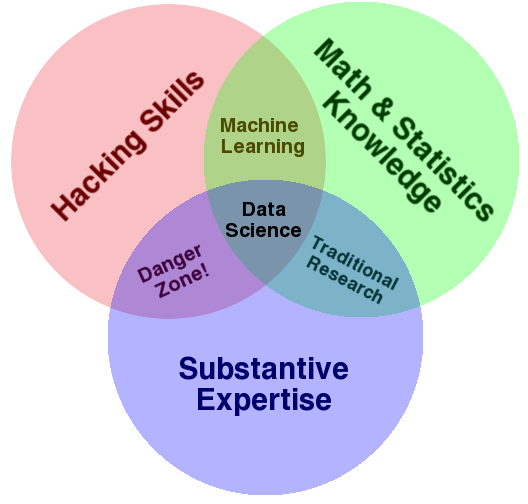
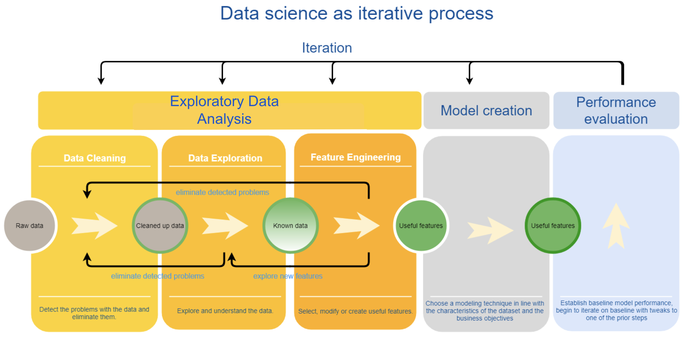

## What is machine learning?

Unlike traditional rule-based statistical analysis, machine learning aims to build systems that can automatically learn and improve from experience without being explicitly programmed. Learning machines are able to adapt to changes in information.

Machine learning includes both *supervised* and *unsupervised* techniques. The core distinction is whether there's a known variable. A model is considered supervised if there is a known target variable, because it "trains" the data to learn how to predict it. But a model is unsupervised if it has no known target variable and because it's free to make connections between data points without having to consider an outside target variable. 

## Machine learning and data science

Machine learning is often the headline-generating part of data science. But machine learning is not the only thing that data scientists do. In fact, even when data scientists *are* doing machine learning, they're not doing *only* machine learning. 

To make sense of the relationship between data science and machine learning, you'll revisit the data science Venn diagram. Focus on the relationship between machine learning and data science. 

Based on this diagram, you can see that machine learning is a subdiscipline of data science (or that data science includes elements of machine learning). How do these relationships work?

Typically, data science projects start with a single, small-scale analysis, usually motivated by a known business problem or objective. Through an iterative process that you'll learn more about, data scientists *learn* about the data. It's perfectly acceptable to call this style of analysis "data science." But it's important to note that this is *not* machine learning. Some data sources, such as customer surveys or clinical trial results, are inherently small datasets that can't become productionized machine-learning models. This is because these sets are small and fairly fixed; they aren't regularly receiving new data.  

Machine learning often comes into play when a data source grows at regular intervals and on a large scale. Big, ever-changing data sources like these are overwhelming, and data scientists can't work on them directly. A machine-learning algorithm allows the system to learn from the data without human intervention. However, this can come at the expense of *interpretability*, or how easily a human can understand or predict a decision or result. Furthermore, there may be bias. 

## The data science workflow

As you're beginning to see, data science is not a one-size-fits-all exercise. Data science is a messy, unpredictable practice, and no two projects are the same. However, data scientists still need *some* guidelines to help them structure and plan their work. 

Below is a basic blueprint of a data science project. This is not an entirely linear process. As you'll see, this is a highly iterative blueprint, and data science projects often involve a nonlinear workflow. Many of the steps outlined below overflow and expand into one another, and sometimes it's necessary to jump across or redo steps, depending on the outcome of a particular stage of the process. 

### Establish the research question and business needs

Data scientists are not simply statisticians or machine-learning engineers—they also have a strong understanding of business objectives. Even before starting a data science project, data scientists and business stakeholders should explicitly agree on the criteria that they'll use to evaluate whether the project is a success. By clearly articulating the business contexts, research questions, and main objectives for the project, the team can ensure that the results of the data science project have value and can be implemented.

Although this step technically lies outside the core data science workflow, no data science project can be successful without these goals, criteria, and contexts to guide the process. 

### Acquire, explore, and clean the data

Like money, good data doesn't just grow on trees. Data scientists have to work for it! Revisiting the "data is the new oil" analogy, you'll see that this step is like drilling for the raw material.

One hallmark of data science is the wide variety of data sources that are used for analysis. Data might be collected from the web, gathered from a traditional scientific experiment, or captured from another activity or channel. Even when the data comes *canned*—in other words, from a flat file or database—data scientists often need to *blend* this data with other data sources to uncover value and meaning. For example, a data scientist at a hospital may want to combine the results of a patient survey with the socioeconomic factors determined by each patient's zip code. This could lead to some interesting public health insights.

Once they've acquired data, data scientists need to get a sense of the overall "look and feel" of it. They ask many questions to better understand the scale, dimensions, and complexity of the data they're working with. How big is it? Are there any anomalies in the data? Were these anomalies caused by human error, or are they truly outliers? Is the data complete, or are there missing values? Are variables categorical or continuous? 

This process of "getting to know" the data is called *exploratory data analysis (EDA)*. EDA employs a variety of techniques to reveal information about the data, and many of these techniques use data visualization. Rigorous statistical techniques are also used to clean the data of potentially bias-inducing data. The statistical concept of *bias* is important here; it's the tendency of a sampling method to over- or under-estimate the value of an underlying "true" population parameter.

### Complete feature engineering

If data is like oil, then the feature-engineering step is like the oil-refining process. This is how data scientists transform potential variables into features. *Features* are designed to make the variables suitable for the kinds of models data scientists will be building. 

Feature engineering covers many kinds of tasks, and the process can involve different activities. For instance, depending on the size of the data and the intended outcome, data scientists may need to recategorize or recode. Depending on the assumptions of the model they plan to use, it might make sense to logarithmically transform variables. And when working with text, they may need to convert all the words to lowercase and fix misspelled words.

These examples barely scratch the surface of feature engineering. But every feature-engineering technique has the same underlying objective: to build features that are more efficient, more robust, and more interpretable in a model.  

### Create a model

Many people believe that model creation is "what data scientists do all day." And although this activity is important, in reality, building and executing a model is only a small part of the workflow. 

A common mistake of inexperienced data scientists is to build the most complex model, with the most data possible, on the first attempt. This method poses a couple of issues. First, the more complex the model is, the harder it is to troubleshoot when something isn't working. Second, when a data scientist uses more data at the outset, they run the risk of building a faulty model—one that has based its results on spurious patterns in the given dataset. In other words, the model can't "generalize" to other data points because it has been designed to model the so-called "training" set, in particular.

This problem is known as *overfitting*, and it's something data scientists constantly look out for. To make sure that their models don't overfit their data, data scientists separate their datasets into *training*, *testing*, and *validation* datasets. This redundancy ensures that the model can hold up to changing datasets. 

For these reasons, data scientists consider their first model a rough draft—or, in [lean startup](http://theleanstartup.com) terms, a [minimum viable product](https://www.techopedia.com/definition/27809/minimum-viable-product-mvp). The first model should capture just enough relationships in the data to be useful, without becoming overly complicated. You don't want your first model to be too difficult to troubleshoot or overfit the data. 

### Evaluate the model's performance 

At this point in the data science project, the results are finally in, and the model is ready to be evaluated. So, how does the model perform? 

As mentioned previously, there is no one criterion by which to evaluate a model. Data scientists and their stakeholders use the business objectives, evaluation criteria, and standards of success that they established earlier in the process to measure the effectiveness of a given model. This way, there's no "cherry-picking the results" to draw an impressive conclusion. 

A model is rarely, if ever, a slam dunk on the first try. When evaluating a model's performance, the data scientist gathers clues on what might be done differently in the next round. They might decide to train the model on more data, include new features, adjust the current features, or try another model entirely. Going back to the drawing board is certainly not a failure, and it happens frequently. There is no one-and-done in data science.

Even a successful data science model needs to be *validated*. Remember the warning by John Mount and Nina Zumel: 

> "The worst possible modeling outcome is not failing to find a good model. The worst possible modeling outcome is thinking you have a good model when you don't."

In supervised machine learning, the goal is to design an algorithm that will develop better predictions when it's presented with more data. That's why it's so important to test that the model can perform well when it's provided with data that it has never encountered before. 

### Iterate

After moving through each step, the data scientist should have a model and a baseline performance of the model. Now it's time for them to iterate by trying different approaches to the model. 

In many ways, iteration in data science follows the [agile methodology](https://agilemanifesto.org/principles.html) of software development; in other words, there's a preference for quick, incremental pushes in improvement. Making small tweaks to the model at each iteration makes it easier to diagnose what's working, and what isn't working, in the model. Other improvements in the model can come from incorporating insights from the business domain and subject matter experts. Ultimately, iteration is often more about fine-tuning the model than reinventing it entirely. 

Over time, each incremental improvement in a model's performance comes with additional effort. And at some point, it becomes necessary to drop the perfectionism and *ship* the data science project. This often means putting the model into *production*, which means the model is incorporated into the day-to-day operations of the business. This is likely what the model was built to do in the first place! The final model could be any number of things—from a product recommendation algorithm that shows Amazon customers various items they might want to buy, to a tool that physicians use to interpret whether a tumor is malignant. Once in production, the model will be a business or research tool, working to meet the objectives that informed its creation.

### Recap

For a visual recap of how data science works, check out the below video.

<iframe id="kaltura_player_1604698377" src="https://cdnapisec.kaltura.com/p/2315191/sp/231519100/embedIframeJs/uiconf_id/45331192/partner_id/2315191?iframeembed=true&playerId=kaltura_player_1604698377&entry_id=1_yujzbfu2" width="100%" height="500" allowfullscreen webkitallowfullscreen mozAllowFullScreen allow="autoplay *; fullscreen *; encrypted-media *" frameborder="0"></iframe>
