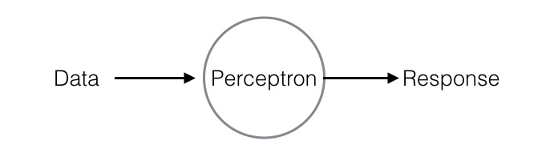
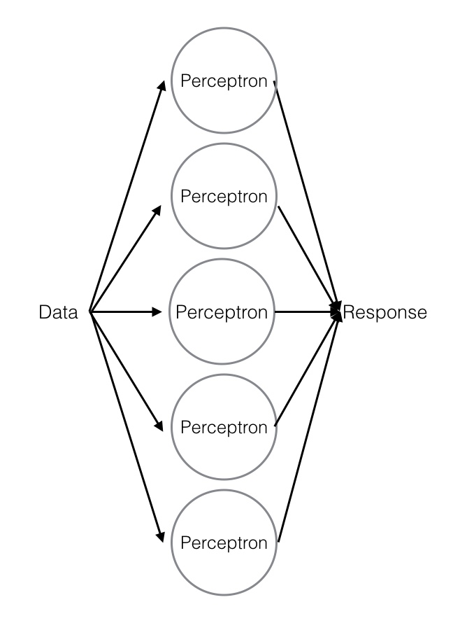
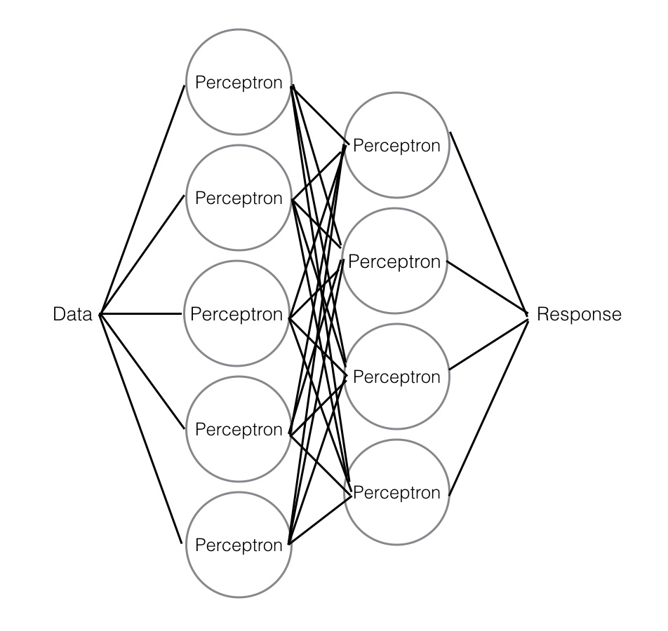

Before you move on, take a moment to check in with yourself. How are these topics going for you? Hopefully, they're hard, but not *too* hard. If all's going well, you've found a sweet spot, where you've been pushing yourself but you have a solid grasp on the core concepts.

But now you're on to neural networks. The ideas behind neural networks can be pretty intense and complex. So get ready to challenge yourself as you learn how they work piece by piece.

First, there are a few disclaimers.

## Disclaimers

 * In this program, you'll focus on classical neural networks, with occasional mentions of more current but less common techniques.
 * The math here is going to be very hand wavy. For most of you, it's better that way. If you want the background math, explore the links and additional resources mentioned throughout this module.
 * Neural networks is an evolving field. If you really love this, you should consider getting a PhD in it, or at least keeping up with the latest papers from the field and industry.
 * Most data science jobs come nowhere near pushing the bounds of neural networks. If you want to do that, there is a smaller list of places where you'll want to apply. And again, a PhD might be necessary for accessing those teams.
 * Some of the newest techniques mentioned here are still controversial. Particularly some of the more classical statisticians have issues with neural networks and deep learning. These techniques are black boxes; initially, it wasn't even really understood why they worked so well in some circumstances. The tide seems to be moving against this perspective, but it is definitely out there.
 * If you want more, [Deep Learning](http://www.deeplearningbook.org/) is a textbook that's a fantastic resource.

Ok, now it's time to actually talk about what a neural network is. To do that, start by thinking about the brain.

## Your brain, neural networks, and you

As a human being, you have a brain—and quite a nice one, by the looks of it! Well done for making it this far in the program.

Your brain and your whole nervous system are made up of neurons and axons. Some of the biology here will be oversimplified—but these simplifications are perpetuated in the machine-learning algorithms that you're learning about, so they are good to know. 

_Neurons_ can be thought of as the information processors of the brain. They react to signals and create responses. _Axons_ connect neurons to each other. A human brain is made up of billions of neurons linked to each other through a complex web of axons. Information passes through several neurons in response to inputs or stimuli.

This is the basis of the machine-learning algorithms known as neural networks. These are sometimes referred to as *artificial neural networks* so as to differentiate neural networks (the computer program) from neural networks (the vital organ).

## Artificial neural networks

To understand what an artificial neural network is, start with the perceptron model that you learned about earlier.

The perceptron model takes in some data and generates a response. Earlier, it was mentioned that this is usually a poorly performing model. You've dealt with this problem in the past using ensemble techniques like bagging, which gave you random forests. Use that concept of ensemble modeling, and include many perceptrons in your model.

Now you're getting closer to a neural network. But there's another ensemble concept that's relevant here: boosting. As you learned earlier, that's when you take the output from one model and use it as the input for another. You can use boosting to feed the results from one part of your model into the next part.

Now that is a serious neural network. There are a few things to note before you move on and start learning how to actually implement these models.

The columns of perceptrons are called _layers_. Neural networks have layers, much like certain pastries, aromatic bulbs, or [green monsters](https://www.youtube.com/watch?v=_bMcXVe8zIs). There are single-layer and multilayer neural networks.

The first layer is called the _visible layer_. Any layers after that first layer are called _hidden layers_. These are features built on features. They are called *hidden* because you're not directly observing their inputs or outputs. They serve as one way of getting around the linearity of the initial perceptron boundary. You now have a function of a function, giving greater detail and subtlety to your model.

This model has many, many perceptrons. And it's not uncommon for a layer to be hundreds or thousands of perceptrons wide. So, how are the perceptrons different from one another? Surely you're not just doing the same thing again and again and again, right? To answer that, recall the initial perceptron. Each variable input into the model was given a weight. Here, your different perceptrons give different variables different sets of weights. When done at a mass scale, they combine to overcome the initial assumption of linearity. This allows for a model where different combinations of variables have hugely different effects. This ultimately generates a very powerful model.

All of the networks that are shown here are what are called *fully connected*—every perceptron in one layer links to every perceptron in the following layer. You can weight your perceptrons so that they are not fully connected or evenly balanced in their connections.

That second image, the one with a single layer of perceptrons, is actually a simple, single-layer neural network. Many-layered networks begin to enter into the realm of _deep learning_.

Also of note is that direction was removed from the third and final image. The way that the layers feed back into each other ends up being a key differentiator in different styles of neural networks, so data does not always flow in one direction.

You'll explore all of this in more detail as you get into implementations. But you should now have a conceptual understanding of what a neural network looks like. Continue on to build one!
